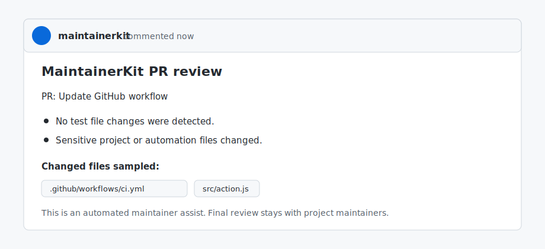

# MaintainerKit

MaintainerKit is a GitHub Action and CLI for open source maintainers. It automates the repetitive parts of issue triage, pull request review, and release preparation while keeping final decisions in the maintainer's hands.

## What it does

- Labels new issues as `bug`, `feature`, `question`, `security`, or `needs-repro`.
- Posts a concise triage note with missing information and next steps.
- Fetches pull request changed files from the GitHub API and checks tests, risky files, and large diffs.
- Creates missing labels before applying them.
- Updates the existing MaintainerKit comment instead of posting duplicate comments.
- Generates release checklists for tag and release workflows.
- Runs in `dry-run` mode by default-friendly CLI workflows before enabling writes.
- Optionally uses OpenAI for a maintainer-facing summary when an API key is provided.

## Quick start

Add `.github/workflows/maintainerkit.yml`:

```yaml
name: MaintainerKit

on:
  issues:
    types: [opened, edited]
  pull_request_target:
    types: [opened, synchronize, reopened]
  release:
    types: [created, edited]

permissions:
  contents: read
  issues: write
  pull-requests: write

jobs:
  maintainerkit:
    runs-on: ubuntu-latest
    steps:
      - uses: actions/checkout@v4
      - uses: WDDong/maintainerkit@v0.2.0
        with:
          dry-run: "false"
          github-token: ${{ github.token }}
          openai-api-key: ${{ secrets.OPENAI_API_KEY }}
```

Add `maintainerkit.yml`:

```yaml
project:
  name: MaintainerKit
  defaultBranch: main

labels:
  bug: bug
  feature: enhancement
  question: question
  security: security
  needsRepro: needs-repro
  needsTests: needs-tests
  needsMaintainerReview: needs-maintainer-review

actions:
  labels: true
  comments: true
  createLabels: true

review:
  maxChangedFiles: 30
  maxAdditions: 1000
  sensitivePaths:
    - package.json
    - action.yml
    - src/github.js
    - .github/workflows/
  testPaths:
    - test/
    - tests/
    - __tests__/
```

## Example output

When a pull request touches a workflow without tests, MaintainerKit can apply `needs-tests` and `needs-maintainer-review`, then create or update one review comment.



## CLI usage

Run MaintainerKit locally against a GitHub event payload:

```bash
npm exec maintainerkit -- --event ./examples/issue-event.json --config ./examples/maintainerkit.yml --dry-run
```

Or run directly from the repository:

```bash
node ./bin/maintainerkit.js --event ./examples/pr-event.json --config ./examples/maintainerkit.yml --dry-run
```

To allow writes from the CLI, provide `GITHUB_TOKEN`, `GITHUB_REPOSITORY`, and `--dry-run false`:

```bash
GITHUB_TOKEN=... GITHUB_REPOSITORY=WDDong/maintainerkit node ./bin/maintainerkit.js --event ./examples/pr-event.json --config ./maintainerkit.yml --dry-run false
```

## Configuration

Use `actions` to control what MaintainerKit is allowed to change:

```yaml
actions:
  labels: true
  comments: true
  createLabels: true
```

- `labels: false` prevents label application.
- `comments: false` prevents issue or PR comments.
- `createLabels: false` requires labels to already exist in the repository.

## OpenAI summary

MaintainerKit works without OpenAI. If `OPENAI_API_KEY` or the `openai-api-key` action input is present, it adds a short maintainer summary using the Responses API. The default model is configurable with `OPENAI_MODEL` and defaults to `gpt-4.1-mini`.

## Maintainer workflow

MaintainerKit is designed to reduce review load, not replace maintainers. Its output is intentionally conservative:

- Labels are suggestions based on title, body, changed files, and release metadata.
- Comments explain why a label or review hint was produced.
- Security-related issue content is flagged for maintainer attention.
- PRs touching sensitive paths get a maintainer review label.

## Roadmap

- GitHub App mode with installation-level settings.
- Dependency risk checks for lockfile changes.
- Release note drafting from merged PRs.
- Contributor onboarding replies for first-time contributors.
- Project health reports for maintainers.

## License

MIT
